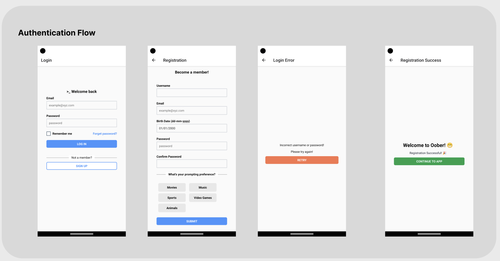
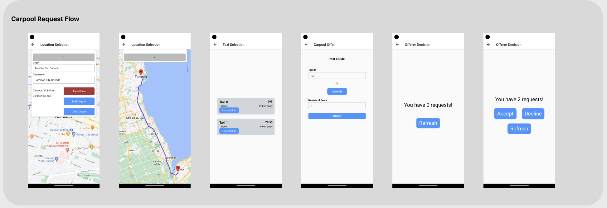
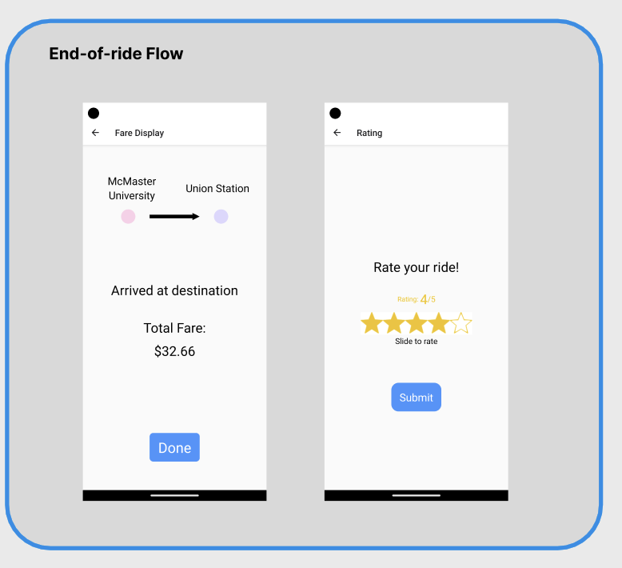

# Welcome to Oober 🎉

Oober is a carpool booking app built using React Native and Express.js. The app allows users to book rides for carpooling with other users, making it convenient and cost-effective for commuting.

## Features

- User authentication and authorization
- Booking and scheduling carpool rides
- Viewing and managing upcoming and past rides
- User ratings and reviews

## Screenshots

## Technology Stack

- React Native
- Android Studio
- SQL
- Express.JS

## Installation

To run the app locally, follow these steps:

1. Clone the repository from GitHub: `git clone <repository-url>`
2. Install dependencies for the backend: `cd backend && npm install`
3. Install dependencies for the frontend: `cd Frontend && npm install`
4. Start the backend server: `cd backend && npm start`
5. Start the frontend app: `cd Frontend && npm react-native start`

Make sure to update the configuration files with appropriate API keys, database credentials, and other environment variables as required.

## Contribution

- Jennifer Ye
- Jane Klavir
- Areez Visram
- Nathan Luong
